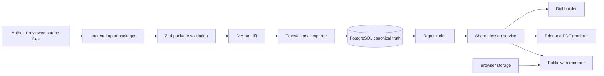

# Qur’anic Arabic Word Tree — Prompt 1 plan

Status: planning and prototype only  
Working name: configurable; prototype label is “Word Tree”  
Public access: required; no account, login, authentication, roles, organisations or tenant model  
Initial scope: sūrahs 109–114, with complete custom teaching content for 112–114 and source-only states for 109–111

## 1. Executive decision

The production build should be a single TypeScript application with a small server layer, PostgreSQL as canonical runtime content, Drizzle as the database layer, Zod as the import boundary, and one shared lesson service consumed by both the web and print renderers.

The first production release is public and anonymous. A learner can open any public route immediately. The only learner state is optional browser storage for current location, completion markers, display preferences and drill progress. That state is never authoritative content and is never uploaded.

The application must not call Quran.Foundation, Tanzil or a morphology provider during an ordinary lesson request. Controlled import/refresh commands bring provider data into versioned packages; transactional imports normalise that data into PostgreSQL; runtime pages read the database through the lesson service.

## 2. Repository assessment

At the start of Prompt 1 the local checkout contained only `.git`, with an empty `origin` repository and no commits or application source. A projectless starter was added because the workspace needed a reviewable frontend foundation. The starter supplied Next.js 16, React 19, TypeScript, Tailwind, Drizzle and Vinext/Cloudflare build tooling.

The starter’s ChatGPT authentication helper and loading skeleton were removed. They were not part of the product direction. The prototype is deliberately fixture-backed and does not pretend that PostgreSQL or the content importer already exists.

Environment constraint: the bundled Sites bootstrap script is Bash-only and WSL has no installed distribution, so the same starter files were copied with PowerShell. Node 20.17.0 is available locally; the starter declares Node 22.13.0 or newer. Prompt 2 must standardise CI and deployment on Node 22.13.0+ before production implementation begins.

## 3. Product boundaries

### Included in the first production release

- Public digital lesson pages for sūrahs 109–114.
- Complete starter Word Tree content for 112–114.
- Source Arabic, āyah structure, word order and available source fields for 109–111.
- Word focus, root picture, construction components, sentence role, recognition clue and form-family comparison.
- Repeated-word links and occurrence-specific context notes.
- Short drills and local completion state.
- A4 āyah handouts, complete-sūrah PDF output and the first A5 volume path.
- Presentation mode for classroom display.
- Public search/navigation over imported content.
- Import validation, dry-run comparison, transactionally safe imports and import history.

### Explicitly excluded

- Registration, login, OAuth, user accounts, user profiles or user APIs.
- Teacher, parent, administrator, organisation, school, classroom or tenant records.
- In-app content authoring, review queues or approval workflows.
- Payments, subscriptions, analytics dashboards, social features, leaderboards or an AI chatbot.
- Live third-party API calls from lesson pages.
- Full custom authoring for the entire Qur’an in the first release.

## 4. System shape



The stable data flow is:

```text
source/provider records + custom teaching files
  → validated import package
  → canonical database records
  → normalised lesson model
  → web, print and drill outputs
```

## 5. Public route map

| Route                               | Purpose                                                  | Rendering                                     | Auth |
| ----------------------------------- | -------------------------------------------------------- | --------------------------------------------- | ---- |
| `/`                                 | Public landing page and continue-learning entry point    | Server shell + client interactions            | None |
| `/surahs`                           | Starter scope, completion state and source/custom status | Server data + local state                     | None |
| `/learn/[surah]/[ayah]`             | Canonical āyah lesson and word focus                     | Server lesson model + client word selection   | None |
| `/learn/[surah]/[ayah]/word/[word]` | Deep-linkable word focus                                 | Server lesson model                           | None |
| `/roots/[root]`                     | Root index and related occurrences                       | Server database query                         | None |
| `/patterns/[pattern]`               | Form-family and grammar pattern index                    | Server database query                         | None |
| `/search`                           | Search by Arabic, transliteration, gloss, root or phrase | Server query route                            | None |
| `/drills/[surah]/[ayah]`            | Drill session                                            | Client interaction over server-provided drill | None |
| `/presentation/[surah]/[ayah]`      | Large classroom display                                  | Minimal client controls                       | None |
| `/print/ayah/[surah]/[ayah]`        | Print preview and PDF source                             | Print layout                                  | None |
| `/print/surah/[surah]`              | Complete sūrah print pack                                | Print layout                                  | None |
| `/print/volume/[volumeId]`          | A5 volume output                                         | Print layout                                  | None |
| `/api/health`                       | Deployment health only                                   | Route handler                                 | None |
| `/api/search`                       | Optional lightweight public search endpoint              | Route handler with rate limit                 | None |

Development-only commands and import status should remain CLI-first. A status page may be added for local review but must not become an authoring system.

## 6. Canonical lesson model

The lesson service should return one normalised model, regardless of whether the caller is a web page, PDF renderer, presentation view or drill builder.

```ts
type LessonModel = {
  id: string;
  surah: {
    number: number;
    arabicName: string;
    transliteration: string;
    label: string;
  };
  ayah: {
    number: number;
    arabic: string;
    translation: string;
    naturalMeaning: string;
  };
  words: Array<{
    occurrenceId: string;
    position: number;
    arabic: string;
    transliteration?: string;
    gloss?: string;
    lessonStatus: "complete" | "source-only";
    teaching?: TeachingWordModel;
    repeatedOccurrences: string[];
  }>;
  sentenceMap: SentenceMapNode[];
  drills: DrillModel[];
  provenance: ProvenanceRecord[];
};
```

Required service functions:

```text
getWordLesson(surahNumber, ayahNumber, wordPosition)
getAyahLesson(surahNumber, ayahNumber)
getSurahLesson(surahNumber)
getVolumeLesson(volumeId)
getRootIndex(root)
getPatternIndex(pattern)
searchLessons(query)
```

The service must explicitly distinguish source data from custom teaching data. A source-only word renders its Arabic, position, source translation and available linguistic evidence with a polished incomplete-content message; it must not show empty placeholder cards or fabricated custom prose.

## 7. Teaching sequence

Every lesson follows the same order:

1. Show the complete Qur’anic word in its āyah.
2. Give its contextual meaning.
3. Identify type and sentence role.
4. Show root and broad root picture where applicable.
5. Show construction and components.
6. Explain grammar in plain English.
7. Show a recognition clue.
8. Show the selected form family last.
9. End with a short takeaway and drill.

This order is part of the product contract, not a styling preference. The print renderer must use the same sequence even when its page layout differs.

## 8. Repeated-word model

Repeated visible words are represented once as shared teaching content and many times as occurrence records. An occurrence may add a context-specific meaning, sentence role or note without copying the full lesson.

Example:

```text
TeachingWordEntry: word-teaching:nas
  ├─ occurrence:114:1:4 → Lord of humankind
  ├─ occurrence:114:2:2 → King of humankind
  ├─ occurrence:114:3:2 → God of humankind
  ├─ occurrence:114:5:5 → people whose chests are affected
  └─ occurrence:114:6:3 → and humankind
```

The UI should make repeat recognition visible without implying that identical words always have identical English phrasing.

## 9. Responsive interface direction

The prototype uses a quiet editorial system: deep teal for trust and structure, burnt orange for the active teaching moment, pale green for learning states and warm paper for printable surfaces. It uses typography, borders, spacing and simple CSS shapes instead of decorative image assets.

- Mobile: one column; horizontal sūrah and āyah selectors; word strip scrolls; root and form family stack below the complete word.
- Tablet: two-column lesson workspace; the lesson map moves below the main lesson when space is tight.
- Desktop: sūrah rail, āyah navigation, lesson canvas and lesson map remain visible together.
- Presentation: one āyah, large Arabic, contextual meaning and word tiles; no authoring or account controls.
- Accessibility: semantic headings, real buttons, visible focus states, `dir="rtl"` for Arabic, keyboard selection, no colour-only status communication and print-safe contrast.

## 10. No-auth state design

The public app must never redirect a learner to sign-in. It must not read identity headers, create sessions or condition content on a user. The only local keys planned are namespaced browser-storage values such as:

```text
qawt:current-location
qawt:completed:<surah>:<ayah>
qawt:viewed-words
qawt:preferences
qawt:drill-progress
```

The site should work when storage is blocked, disabled or cleared. There is no recovery promise for local progress because it is intentionally device-local.

## 11. Production decisions that should not be reopened casually

- PostgreSQL is canonical; loose JSON is import input only.
- Drizzle is the first-choice ORM because it stays close to SQL and supports PostgreSQL migrations.
- Zod is the import boundary and schema versioning tool.
- Provider records remain separate and are normalised; no provider silently overwrites another.
- Quran.Foundation credentials stay server-side and are used only by controlled import/refresh jobs.
- Tanzil text is retained verbatim with its required attribution and link.
- Quranic Arabic Corpus and QuranMorph are evidence sources, not automatic authors of the project’s teaching prose.
- Paged.js is the primary print candidate; Vivliostyle remains the fallback evaluation path.
- The first build is one deployable application, not microservices or background infrastructure.

## 12. Decisions requiring owner review

1. Which English translation/licensing combination is approved for redistribution in the public app and printed books?
2. Which exact Quran.Foundation client credentials and production application registration will be used for controlled import?
3. Which Qur’anic font bundle and script variants should be shipped for the first release (Madani only, or Madani plus IndoPak and Tajwīd)?
4. Does the first public PDF release include the complete final-six-sūrahs volume, or only single-āyah and single-sūrah output?
5. Who signs off custom teaching content before it is imported into production?

All other implementation choices are specified in the production plan and should proceed without reopening the architecture during Prompt 2.
